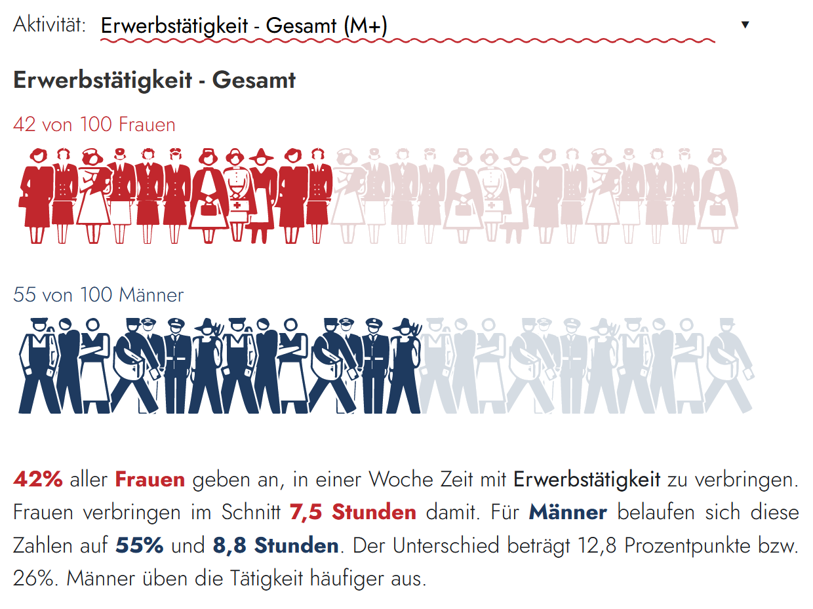

# Isoline

Modern isotype visualizations inspired by [Otto and Marie Neurath's ISOTYPE system](https://en.wikipedia.org/wiki/Isotype_(picture_language)), built with [Quarto](https://quarto.org/), [D3.js](https://d3js.org/), and [Observable](https://observablehq.com/).

[](https://schmoigl.github.io/isoline/)

**Live:** [schmoigl.github.io/isoline](https://schmoigl.github.io/isoline/) · [Observable Notebook](https://observablehq.com/@schmoigl/isotypify-your-data)

## Getting Started

```bash
git clone https://github.com/schmoigl/isoline.git
cd isoline
quarto preview
```

## Usage

```javascript
makeIsoline({
  persPerLineValue: 20,
  data: [
    {
      key: "Women",
      value: 0.75,
      shapes: "abcdefg",
      fillHighlight: "coral",
      fillNormal: "#eee"
    }
  ]
})
```

## Technologies

- **[Quarto](https://quarto.org/)** - Publishing system with [Observable JS](https://quarto.org/docs/interactive/ojs/) integration
- **[D3.js](https://d3js.org/)** - Data visualization
- **[Isotype Font](https://fonts.cdnfonts.com/isotype.font)** - 234+ pictographic glyphs
- **[DM Sans Font](https://fonts.google.com/specimen/DM+Sans)** - Headings and body text

## Resources

- [ISOTYPE - Wikipedia](https://en.wikipedia.org/wiki/Isotype_(picture_language))
- [Quarto with Observable](https://quarto.org/docs/interactive/ojs/)
- [Observable Gallery](https://observablehq.com/@observablehq/gallery)
- [D3 Gallery](https://observablehq.com/@d3/gallery)

---

**Maintained by:** [@schmoigl](https://github.com/schmoigl) | **Organization:** [WIFO](https://www.wifo.ac.at/)
